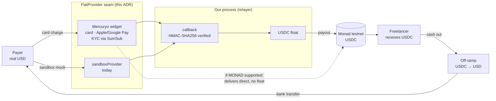

# ADR 0003: Mercuryo for the card leg

Date: 2026-10-09. Status: proposed, gated on the check below.

## Context
ADR-0002 added a card leg behind a `FiatProvider` seam and shipped a sandbox stand-in. A seam with only a mock behind it is not worth much, so it needs a real provider. The repo already surveyed the options in `docs/payments-stack.md` §2: Mercuryo is a hosted on-ramp/off-ramp widget with a sandbox, card plus Apple Pay, Google Pay and local APMs, and KYC handled by them through SumSub (light-KYC to EUR 699).

## Decision
Mercuryo, behind the existing seam, as a third `FiatProvider` alongside the sandbox.

## How the seam sits

Two seams, one on each side of Monad. The `FiatProvider` seam is the one this ADR decides; the wallet leg already exists and stays untouched.

Read it as: **USD goes in at the card, USDC exists only on Monad, USD comes back out at the off-ramp.** Mercuryo owns both fiat edges; we own nothing but the on-chain middle; the seam is what makes the provider swappable without the middle noticing.

The dotted edge is the whole point of the gate: if Mercuryo supports Monad it delivers straight to the freelancer and the float, the callback and the payout leg all drop out of the card path.

## The gate
Everything downstream depends on one fact that cannot be checked without an account: whether the widget offers MONAD as a `network`, and USDC as a currency on it. The widget takes `address` + `network` + `currency` and delivers the purchased crypto to that address, so this decides whether we ever hold the crypto at all.

- **Monad supported**: Mercuryo delivers USDC straight to the freelancer. No float, no payout leg, and our custody shrinks to the seconds Mercuryo holds the fiat. The payout code from ADR-0002 then serves only the wallet leg.
- **Monad unsupported**: Mercuryo can only deliver to a chain it supports. We keep the float, have Mercuryo deliver to our own address on that chain as reimbursement, and pay out on Monad from there.

## Alternatives
- **Stripe**: best test mode, but card-only, so it never delivers crypto and leaves the entire float burden with us under either shape.
- **Agora routes**: real mint and redeem of AUSD, but needs a registered business account, so out of scope for the hackathon.

## Consequences
- **Two different signatures, easy to conflate**: the widget URL carries `v2:` + SHA-512 over the request parameters, while the callback carries HMAC-SHA256 over the raw request body in `X-Signature`.
- **Callbacks retry on any non-200 for up to 3 days**, so idempotency keyed on `merchant_transaction_id` is mandatory rather than defensive.
- **The redirect back to our page is not proof of payment.** Only the verified callback is.
- **Off-ramp and Spend Card are disabled by default** and need an integration manager, so "the freelancer cashes out to a bank" is a conversation, not a config flag.
- Mainnet stays gated on the compliance work in ADR-0002. Real fiat must never buy testnet tokens.
