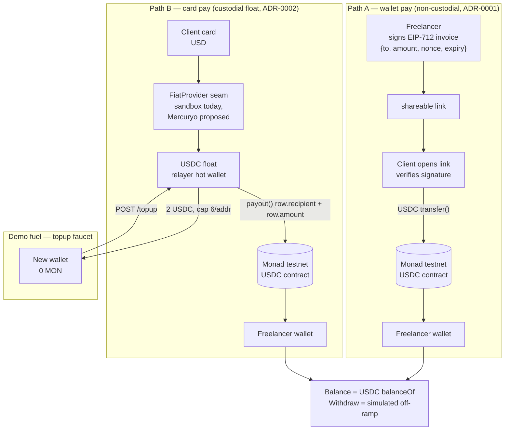

# Money flows — how money moves and why users care

Two payment paths, one rule: **no contract ever holds money.**
Sources: `adr/0001-offchain-invoices-no-escrow.md`, `adr/0002-fiat-card-checkout.md`,
`adr/0003-mercuryo-card-leg.md`, `payments-stack.md`, `gas-for-new-wallets.md`.

## Custody

- **Path A (wallet pay):** direct USDC transfer, payer wallet → freelancer wallet.
  The signed invoice is verified by the payer before signing; the link moves no funds.
- **Path B (card pay):** custodial only here — the platform holds the payer's fiat
  (provider account) and the USDC float that settles payouts.
  `payout()` only ever pays the recipient + amount on a stored request row, never an
  address the caller names (`app/src/relayer-server.ts`).
- **Top-up:** the float funds zero-MON demo wallets (2 USDC per top-up, 6 per
  address, 100k global ceiling in `app/src/lib/cap.ts`). Monad rejects
  zero-balance senders, so new wallets cannot pay their own gas
  (`gas-for-new-wallets.md`).

## Why a user picks this (PRD §1.3–1.6, pitch deck)

| | Fiverr / Upwork | PayPal / Wise link | Ping Pong Pay |
|---|---|---|---|
| Fee on $500 | up to $100 (20%) | ~$9.50 + 3–4% FX spread | ~1% target, no marketplace cut |
| Wait | 7–14 day hold | hours–5 days | ~1s, straight to balance |
| Client effort | account + onboarding | bank/card setup | open link, Face ID, tap Pay |
| FX games | — | rate set 3–4% below real | USDC = USD on screen, converts only at cash-out, rate shown first |

## Honest limits

- Withdraw is simulated — no bank connected, nothing moves.
- Activity history and replay protection read ~100 blocks (~30s); Monad's public
  RPC rejects wider log queries.
